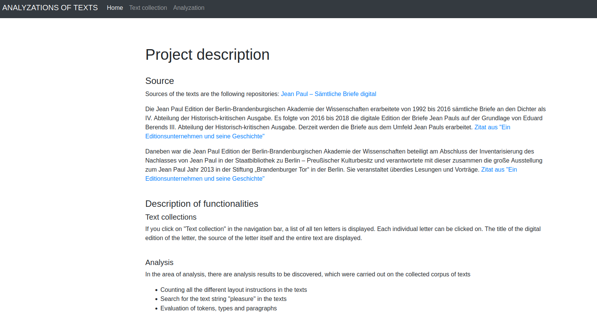
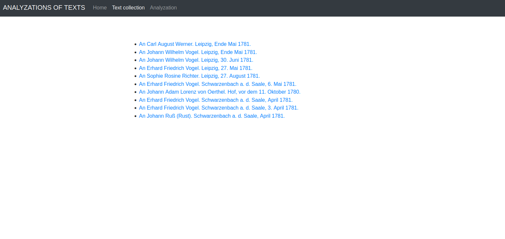
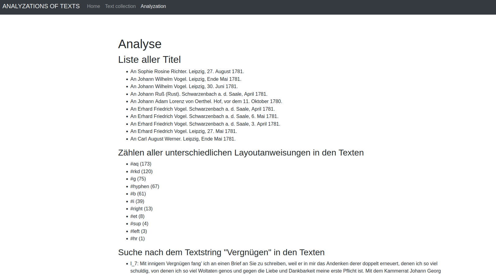

# Text Analyzation

## :newspaper: About the project

This is small project about the analyzation of multiple letters.

### How it works

1. [Install and run](https://exist-db.org/exist/apps/doc/basic-installation) the eXist-db.

2. Download the project from github and save the project in folder of your choice.

3. Then upload the project in 
   
4. [Upload](https://exist-db.org/exist/apps/doc/uploading-files) the content in exist-db.

5. Run the `index.query` file.

6. The Output of the website look like this:

    a. The Homepage provides a short overview about what the website is for:

    

    b. The Text Collection part displays a list with all available texts.

    

    c. The Analyzation uses stastical analyzations about the text, so that is possible to read the text without reading the text-

    

### Content overview

    .
    ├── css/ - styling sheets
    ├── data/ - letters encoded in xml
    ├── img/ - images for the README.md
    ├── js/ - javascript for application
    ├── analyze-all.xquery - source code for entire statistical analyzation for all letters
    ├── index.xquery - program entry point
    ├── README.md - relevant information about the project
    ├── title-html.xquery - 
    ├── title.xquery - 
    └── title.xsl - xsl transformation script for all titles

## :notebook: Features

* Text analyzation of multiple letters
  * xml format checking
  * case sensitivity checking (done by python)

## :books: Resources used to create this project

* JavaScript
  * [JavaScript reference](https://devdocs.io/javascript/)
* CSS
  * [CSS](https://getbootstrap.com/docs/3.4/css/)
* XQuery
  * [XQuery 3.1: An XML Query Language](https://www.w3.org/TR/xquery-31/)
  * [XQuery 3.1](https://docs.basex.org/wiki/XQuery_3.1)
* Markdwon
  * [Basic syntax](https://www.markdownguide.org/basic-syntax/)
  * [Complete list of github markdown emofis](https://dev.to/nikolab/complete-list-of-github-markdown-emoji-markup-5aia)
  * [Awesome template](http://github.com/Human-Activity-Recognition/blob/main/README.md)
  * [.gitignore file](https://git-scm.com/docs/gitignore)
* Editor
  * [Visual Studio Code](https://code.visualstudio.com/)
  * [eXist-db OpenSourceNative XML Database - Documentation](https://exist-db.org/exist/apps/doc/documentation)

## :bookmark: License

This project is licensed under the terms of the [GPL v3](LICENSE).
